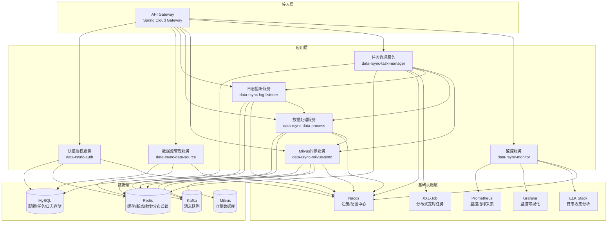

# Data Rsync System 技术架构文档

## 1. 系统架构

### 1.1 分层架构

### 1.2 核心流程

#### 1.2.1 增量同步流程

1. **日志监听**：LogListener 服务使用 Debezium 监听数据源的日志（binlog/wal/oplog）
2. **消息分发**：将捕获的变更数据发送到 Kafka 消息队列
3. **数据处理**：DataProcess 服务消费 Kafka 消息，进行数据转换和向量化处理
4. **数据写入**：MilvusSync 服务消费处理后的数据，批量写入 Milvus 向量数据库
5. **任务监控**：TaskManager 服务监控整个同步过程，记录任务状态和进度

#### 1.2.2 全量同步流程

1. **任务触发**：TaskManager 服务触发全量同步任务
2. **分片扫描**：LogListener 服务对大表进行分片扫描，并行执行
3. **数据处理**：DataProcess 服务对扫描的数据进行转换和向量化处理
4. **批量写入**：MilvusSync 服务批量写入 Milvus 向量数据库
5. **索引优化**：全量同步完成后，MilvusSync 服务触发索引重建
6. **切换增量**：全量同步完成后，自动切换到增量监听模式

## 2. 核心功能模块

### 2.1 数据源管理模块

#### 2.1.1 功能设计

- **多源数据库适配**：支持 MySQL、PostgreSQL、Oracle、SQL Server、MongoDB、Redis 等数据源
- **数据源生命周期管理**：新增、编辑、删除、启用/禁用、连接测试、健康状态监控
- **权限与加密**：账号密码加密存储（AES），按角色分配数据源操作权限

#### 2.1.2 技术实现

- 使用 JPA 进行数据源配置的持久化存储
- 使用 Redis 进行数据源健康状态缓存
- 使用 Spring Security 进行权限控制
- 使用 Jasypt 进行敏感信息加密

### 2.2 日志监听模块

#### 2.2.1 功能设计

- **增量日志监听**：适配不同数据库的日志协议，支持 binlog、wal、oplog 等
- **日志过滤**：按表名、操作类型、时间范围、数据字段值过滤
- **断点续传**：记录最后监听的日志位点，系统重启后从断点继续
- **日志消费速率控制**：支持限流，避免下游同步压力过大
- **全量数据扫描**：支持手动触发、定时触发、增量同步前预全量
- **分片扫描**：对大表按主键/分片键拆分扫描任务，支持并行执行
- **全量-增量衔接**：全量扫描完成后自动切换至增量监听

#### 2.2.2 技术实现

- 使用 Debezium 作为 CDC 框架，支持多源数据库日志监听
- 使用 Kafka 作为消息队列，实现异步解耦
- 使用 Redis 存储断点续传位点和任务状态
- 使用 XXL-Job 实现定时全量同步任务

### 2.3 数据处理模块

#### 2.3.1 功能设计

- **数据转换**：字段映射、类型转换、重命名
- **向量生成**：内置文本转向量（对接 OpenAI/智谱 AI）、结构化数据向量化
- **数据清洗**：空值处理、重复数据去重、数据格式校验
- **数据缓存与批量处理**：按批次缓存增量数据，批量写入 Milvus

#### 2.3.2 技术实现

- 使用 Kafka 消费日志监听服务产生的消息
- 使用 Redis 缓存向量化结果和处理状态
- 使用线程池实现并行数据处理
- 使用批量处理机制减少 Milvus 写入请求数

### 2.4 Milvus 同步模块

#### 2.4.1 功能设计

- **Milvus 连接管理**：支持单机/集群模式，连接池管理
- **数据写入**：支持覆盖写入、追加写入、删除同步
- **写入重试**：网络异常/服务不可用时支持重试，失败后写入死信队列
- **Milvus 索引管理**：自动创建/更新向量索引，支持索引参数配置
- **索引优化**：全量同步完成后触发索引重建
- **数据校验**：同步完成后，支持源库与 Milvus 数据条数核对、抽样数据内容校验

#### 2.4.2 技术实现

- 使用 Milvus Java SDK v2.x 与 Milvus 交互
- 使用连接池管理 Milvus 连接，设置空闲超时时间
- 使用批量写入 API 提高写入性能
- 使用事务保证数据一致性
- 使用 Redis 存储死信队列数据

### 2.5 任务管理模块

#### 2.5.1 功能设计

- **任务配置**：支持全量任务、增量任务、全量+增量任务
- **任务启停**：手动启停、定时启停、依赖触发
- **任务监控**：实时监控任务状态、同步进度、同步速率、延迟
- **历史记录**：任务执行日志、任务执行统计
- **任务重试与恢复**：失败任务自动重试，支持从断点继续执行

#### 2.5.2 技术实现

- 使用 XXL-Job 实现分布式任务调度
- 使用 JPA 存储任务配置和执行记录
- 使用 Redis 缓存任务状态和进度
- 使用 Nacos 进行配置管理

### 2.6 监控告警模块

#### 2.6.1 功能设计

- **指标监控**：系统指标（CPU、内存、磁盘 IO、网络带宽）、业务指标（数据源连接状态、日志监听延迟、数据转换耗时、Milvus 写入成功率/耗时、同步数据总量/增量数据量）
- **告警管理**：支持邮件、钉钉、企业微信、短信、日志告警
- **告警分级**：严重、警告、提示，支持分级通知不同角色

#### 2.6.2 技术实现

- 使用 Prometheus 采集监控指标
- 使用 Grafana 进行监控可视化
- 使用 ELK Stack 进行日志收集和分析
- 使用 Spring Boot Actuator 暴露服务健康状态

### 2.7 日志与审计模块

#### 2.7.1 功能设计

- **系统日志**：记录所有模块的操作日志，支持按时间/模块/级别查询、日志归档
- **审计日志**：记录用户操作行为，包含操作人、操作时间、操作内容、IP 地址，支持审计日志不可篡改

#### 2.7.2 技术实现

- 使用 Logback + Logstash 进行日志收集
- 使用 Elasticsearch 存储和索引日志
- 使用 Kibana 进行日志查询和可视化
- 使用 MySQL 存储审计日志，设置权限控制确保不可篡改

### 2.8 权限管理模块

#### 2.8.1 功能设计

- **用户管理**：用户新增/删除/编辑、密码重置、状态管理
- **角色管理**：内置角色（超级管理员、管理员、操作员、查看员），支持自定义角色
- **权限控制**：基于 RBAC 模型，细粒度控制接口/页面/按钮权限，支持数据权限

#### 2.8.2 技术实现

- 使用 Spring Security + JWT 实现认证授权
- 使用 JPA 存储用户、角色、权限信息
- 使用 Redis 缓存权限信息，提高性能
- 使用 Nacos 进行配置管理

## 3. 关键技术点

### 3.1 多源数据库适配

- **技术方案**：基于 Debezium CDC 框架，支持多源数据库的变更数据捕获
- **核心实现**：
  - 为每种数据库实现专门的监听器，如 MySQLBinlogListener、PostgresWalListener、MongoDbOplogListener
  - 使用 SPI 机制实现监听器的动态加载，便于扩展新的数据源类型
  - 支持数据库版本兼容性处理，如 MySQL 5.7 和 8.0 的 binlog 格式差异

### 3.2 CDC 机制优化

- **技术方案**：Debezium + Kafka + Redis
- **核心实现**：
  - 使用 Debezium 引擎的嵌入式模式，减少部署复杂度
  - 配置合理的批处理大小和提交间隔，平衡实时性和性能
  - 使用 Redis 存储断点续传位点，确保系统重启后从断点继续
  - 实现日志过滤机制，只同步符合条件的数据，减少数据传输量

### 3.3 向量化处理

- **技术方案**：本地 FastText + 云端 OpenAI Embedding
- **核心实现**：
  - 定义 Vectorizer 接口，支持多种向量化算法
  - 内置文本向量化实现，支持对接 OpenAI/智谱 AI 的 Embedding 接口
  - 支持结构化数据向量化，如数值特征拼接后归一化
  - 实现向量化结果缓存，避免重复计算
  - 支持用户自定义向量化算法，通过 SPI 机制加载

### 3.4 Milvus 操作优化

- **技术方案**：Milvus Java SDK + 连接池 + 批量写入
- **核心实现**：
  - 实现 Milvus 连接池管理，设置空闲超时时间，定期检测连接可用性
  - 使用批量写入 API，根据 Milvus 性能调整批量大小（建议 100-1000 条/批）
  - 开启事务支持，确保增量删除/更新操作的数据一致性
  - 实现索引优化策略，全量同步完成后再创建索引，避免边写入边创建索引导致性能下降
  - 根据数据量选择合适的索引类型，小数据量用 IVF_FLAT，大数据量用 HNSW

### 3.5 分布式任务调度

- **技术方案**：XXL-Job + Redis 分布式锁
- **核心实现**：
  - 使用 XXL-Job 实现分布式定时任务调度，支持任务分片、失败重试、日志追踪
  - 实现 Redis 分布式锁，避免多实例并发执行同一任务
  - 支持任务依赖配置，如上游任务完成后启动下游任务
  - 实现任务优先级管理，确保重要任务优先执行

### 3.6 监控与告警

- **技术方案**：Prometheus + Grafana + ELK + 多渠道告警
- **核心实现**：
  - 使用 Prometheus 采集系统和业务指标，设置合理的采集间隔
  - 使用 Grafana 创建监控面板，可视化展示系统运行状态
  - 使用 ELK Stack 收集和分析日志，支持日志检索和可视化
  - 实现多渠道告警，支持邮件、钉钉、企业微信、短信等方式
  - 设置分级告警策略，根据告警级别通知不同角色

### 3.7 安全性

- **技术方案**：HTTPS/TLS + JWT/OAuth2 + Jasypt + 权限控制
- **核心实现**：
  - 配置 HTTPS/TLS，确保数据传输加密
  - 使用 JWT/OAuth2 实现接口鉴权，避免未授权访问
  - 使用 Jasypt 加密配置文件中的敏感信息，如数据库密码、API 密钥
  - 基于 RBAC 模型实现细粒度权限控制，支持接口/页面/按钮权限
  - 实现数据权限控制，如操作员仅能管理指定数据源的任务
  - 防范 SQL 注入、XSS 攻击、CSRF 攻击等安全威胁

## 4. 性能优化

### 4.1 内存管理

- **核心实现**：
  - 全量同步分片读取数据，每批处理完成后手动释放对象引用，避免 OOM
  - 使用 JVM 参数（如 -Xmx/-Xms）限制堆内存，配置 GC 策略（G1）
  - 实现对象池，重用频繁创建的对象，减少 GC 压力
  - 使用内存映射文件处理大文件，减少内存使用

### 4.2 限流与熔断

- **核心实现**：
  - 使用 Sentinel 对数据源监听限流，避免高并发日志压垮服务
  - 对 Milvus 写入熔断，Milvus 服务不可用时暂停写入，避免大量失败请求堆积
  - 在 API 网关层实现限流，防止恶意请求攻击
  - 实现服务降级策略，当系统负载过高时，停止非核心功能，保证核心功能正常运行

### 4.3 批量处理

- **核心实现**：
  - 日志监听批量捕获变更数据，减少网络传输次数
  - 数据处理批量转换和向量化，提高处理效率
  - Milvus 批量写入，减少 Milvus 写入请求数，提高写入性能
  - 批量提交数据库事务，减少数据库 I/O 操作

### 4.4 缓存优化

- **核心实现**：
  - 使用 Redis 缓存热点数据，如数据源配置、任务状态、向量化结果
  - 实现缓存过期策略，避免缓存数据过期导致的问题
  - 使用本地缓存（如 Caffeine）缓存高频访问的数据，减少 Redis 访问压力
  - 实现缓存预热，系统启动时加载热点数据到缓存

## 5. 高可用性

### 5.1 服务高可用

- **核心实现**：
  - 微服务集群部署，避免单点故障
  - 使用 Nacos 作为服务注册中心，实现服务自动发现和负载均衡
  - 实现服务健康检查，当服务不可用时自动剔除
  - 配置合理的超时和重试机制，提高服务调用可靠性

### 5.2 数据高可用

- **核心实现**：
  - MySQL 主从复制，确保数据持久化和高可用
  - Redis 集群，确保缓存数据高可用
  - Kafka 集群，确保消息队列高可用
  - Milvus 集群，确保向量数据库高可用
  - 实现数据备份和恢复机制，定期备份关键数据

### 5.3 配置高可用

- **核心实现**：
  - 使用 Nacos 作为配置中心，支持配置热更新和高可用
  - 实现配置版本管理，支持配置回滚
  - 配置多环境隔离，避免不同环境的配置相互影响

## 6. 可扩展性

### 6.1 模块解耦

- **核心实现**：
  - 基于微服务架构，模块间通过 RESTful API 或消息队列通信
  - 定义清晰的接口契约，避免模块间耦合
  - 使用 SPI 机制实现插件化扩展，如新增数据源类型、向量化算法

### 6.2 水平扩展

- **核心实现**：
  - 服务无状态设计，支持水平扩展
  - 使用 Kubernetes 或 Docker Compose 实现容器化部署，便于水平扩展
  - 实现服务自动伸缩，根据负载动态调整服务实例数

### 6.3 功能扩展

- **核心实现**：
  - 设计可扩展的数据源适配框架，支持新增数据源类型
  - 设计可扩展的向量化算法框架，支持新增向量化算法
  - 设计可扩展的 Milvus 版本适配框架，支持 Milvus 版本升级
  - 设计可扩展的告警渠道框架，支持新增告警方式

## 7. 开发与部署

### 7.1 开发环境

- **核心实现**：
  - 使用 Docker 容器化开发环境，确保开发环境一致性
  - 配置本地开发配置文件，支持快速启动和调试
  - 实现本地模拟服务，如模拟 Milvus、Kafka 等，减少外部依赖

### 7.2 测试环境

- **核心实现**：
  - 配置独立的测试环境，与生产环境隔离
  - 使用 Testcontainers 实现集成测试，确保测试环境一致性
  - 实现自动化测试脚本，支持持续集成

### 7.3 生产环境

- **核心实现**：
  - 使用 Kubernetes 或 Docker Compose 实现容器化部署
  - 配置生产环境配置文件，优化性能和安全性
  - 实现自动化部署脚本，支持持续部署
  - 配置监控和告警，确保生产环境稳定运行

## 8. 总结

Data Rsync System 采用 Java 微服务架构，基于 Spring Cloud 生态实现，核心功能是监听多源数据库的日志，支持全量/增量数据同步至 Milvus 向量数据库。系统具有高可用、高性能、可扩展、安全可靠等特点，能够满足企业级数据同步需求。

通过合理的架构设计、技术选型和性能优化，系统能够高效处理大规模数据同步任务，为企业提供实时、准确的数据同步服务，支撑业务决策和智能化应用。
